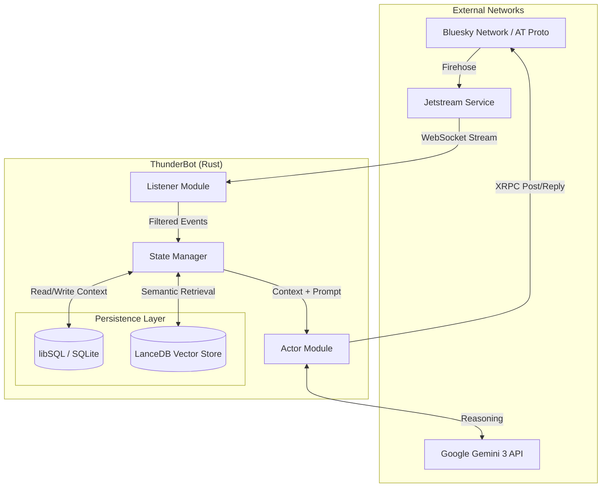

# THUNDERBOT

**A Stateful AI Agent powered by Gemini 3 that lives in the Atmosphere.**

ThunderBot is a sophisticated social automation system that goes beyond stateless "trigger-action" bots.
By leveraging the AT Protocol's open data firehose and Google's Gemini 3 "Thinking" models, it maintains persistent conversational context, reasons about user interactions, and evolves its internal state over time.

## System Architecture

The system operates on an Event-Driven Architecture (EDA) built in Rust.
It ingests the AT Protocol Firehose, filters for relevance, reconstructs thread history from a local database, and uses a Large Language Model to generate context-aware responses.

## Key Features (*planned*)

- **Stateful Memory**: Persists conversation history and user identity mappings locally using libSQL, enabling multi-turn context without expensive API polling.
- **Cognitive Reasoning**: Utilizes Gemini 3's "Thinking" process to evaluate complex queries, detect loops, and self-correct before posting.
- **Efficient Ingestion**: Consumes the AT Protocol Firehose via Jetstream, filtering out 99% of irrelevant traffic to minimize overhead.
- **Semantic Retrieval**: Implements RAG (Retrieval-Augmented Generation) via LanceDB to recall historical facts beyond the immediate conversation window.
- **Safety First**: Includes loop prevention, self-moderation, and "Silent Mode" capabilities.

## Technologies Used

| Component        | Library                |
| ---------------- | ---------------------- |
| Runtime          | Native binary (tokio)  |
| HTTP Framework   | axum                   |
| Jetstream Client | Manual                 |
| Bluesky SDK      | Manual XRPC            |
| Database         | libsql (embedded)      |
| Vector Store     | LanceDB (embedded)     |
| AI Provider      | Gemini 3 (gemini-rust) |
| Templating       | maud                   |
| CLI Framework    | clap (derive)          |
