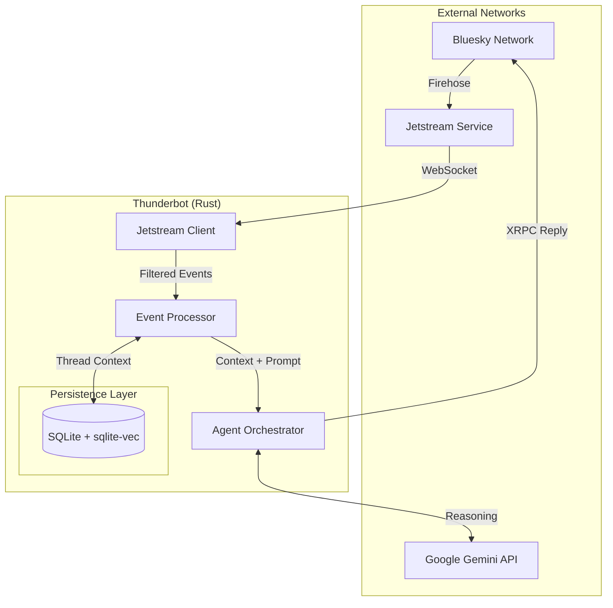

# Thunderbot

A stateful AI agent powered by Gemini that lives in the Atmosphere.

Thunderbot is a social automation system that goes beyond stateless "trigger-action" bots.
By opening a connection to the AT Protocol's open data firehose and using Google's Gemini models, it maintains persistent conversational context, reasons about user interactions, and evolves its internal state over time.

## Architecture

Event-driven architecture built in Rust that ingests the AT Protocol firehose via Jetstream, filters for mentions, reconstructs thread history from a local database, and uses Gemini to generate context-aware responses.



## Features

- **Stateful Memory**: Persists conversation history and identity mappings using libSQL
- **Semantic Retrieval**: RAG via sqlite-vec for recalling historical context
- **Efficient Ingestion**: Consumes Jetstream with zstd compression, filtering irrelevant traffic
- **Loop Prevention**: Detects self-replies and supports silent mode for internal reasoning

## Tech Stack

| Component      | Implementation            |
| -------------- | ------------------------- |
| Runtime        | Rust + Tokio              |
| Firehose       | Jetstream (WebSocket)     |
| Bluesky API    | Manual XRPC via reqwest   |
| Database       | libSQL (SQLite)           |
| Vector Search  | sqlite-vec + FTS5         |
| AI             | Gemini API                |
| CLI            | clap                      |

## Quick Start

```bash
# Build
cargo build --release

# Configure
cp .env.example .env
# Edit .env with your credentials

# Login to Bluesky
cargo run -- bsky login

# Test AI integration
cargo run -- ai prompt "Hello"

# Start listening for mentions
cargo run -- jetstream listen
```

## Environment Variables

| Variable           | Description                |
| ------------------ | -------------------------- |
| `DATABASE_URL`     | SQLite database path       |
| `BSKY_HANDLE`      | Your Bluesky handle        |
| `BSKY_APP_PASSWORD`| App password from Bluesky  |
| `PDS_HOST`         | PDS URL (bsky.social)      |
| `GEMINI_API_KEY`   | Google AI API key          |
| `GEMINI_MODEL`     | Model ID (optional)        |

## Documentation

- [Architecture](docs/architecture.md) - System design and data flow
- [Protocols](docs/protocols.md) - Jetstream and XRPC reference
- [Gemini Integration](docs/gemini-integration.md) - AI configuration
- [Constitution](docs/constitution.md) - Agent persona definition
- [Changelog](CHANGELOG.md) - Release history
- [Roadmap](ROADMAP.md) - Upcoming milestones
