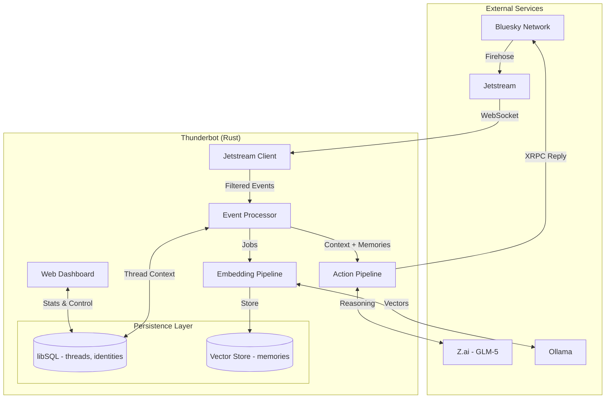

<!-- markdownlint-disable MD033 -->
# Thunderbot

Stateful AI agent that lives on Bluesky. Ingests the AT Protocol firehose, reconstructs conversation threads, retrieves relevant memories via hybrid semantic/keyword search, and generates context-aware replies using GLM-5.

## Quick Start

### Prerequisites

- Rust 1.86+
- A Bluesky account with an App Password
- (Optional) GLM-5 API key for AI responses
- (Optional) [Ollama](https://ollama.com) for embedding-based memory

### Installation

```bash
# Clone and build
git clone https://github.com/yourusername/thunderbot.git
cd thunderbot
cargo build --release

# Or run directly with cargo
cargo run -p tnbot-cli -- --help
```

## Configuration

Configuration is loaded from (in order of precedence):

1. `--config /path/to/config.toml` flag
2. `tnbot.toml` in the working directory
3. Embedded defaults
4. Environment variables (prefixed with `TNBOT_`, double underscore for nesting: `TNBOT_AI__MODEL`)
5. `.env` file in the working directory

### Minimal Configuration

Create a `.env` file in your working directory:

```bash
# Required: Your Bluesky credentials
BSKY_HANDLE=yourhandle.bsky.social
BSKY_APP_PASSWORD=your-app-password-here

# Required: Your bot's DID (find it at https://plc.directory/yourhandle.bsky.social)
TNBOT_BOT_DID=did:plc:xxxxx

# Optional: GLM-5 API key for AI responses
GLM_5_API_KEY=your-glm5-api-key
```

<details>
<summary><code>tnbot.toml</code> full example</summary>

```toml
[bot]
name = "ThunderBot"
did = "did:plc:xxxxx"

[bluesky]
handle = "yourhandle.bsky.social"
app_password = "your-app-password-here"
pds_host = "https://bsky.social"

[database]
path = "./data/thunderbot.db"

[logging]
level = "info"
format = "pretty"  # or "json"

[ai]
model = "glm-5"
temperature = 0.7
max_tokens = 300

[embedding]
provider = "ollama"
model = "nomic-embed-text"
dimensions = 768
batch_size = 10

[memory]
enabled = true
ttl_days = 90
consolidation_delay_hours = 24
dedup_threshold = 0.95
```

</details>

### Getting Your DID

```bash
cargo run -p tnbot-cli -- bsky resolve yourhandle.bsky.social
```

## Usage

### Running the Bot

```bash
# Start the bot daemon (includes web dashboard on :3000)
tnbot serve

# Dry-run mode (processes events but doesn't post replies)
tnbot serve --dry-run

# With verbose logging
tnbot -vv serve

# Output logs as JSON
tnbot --json serve
```

<details>
<summary>Bluesky Commands</summary>

```bash
# Authenticate and test your credentials
tnbot bsky login

# Check current session
tnbot bsky whoami

# Create a new post
tnbot bsky post "Hello from Thunderbot!"

# Reply to a post
tnbot bsky reply "at://did:plc:xxx/app.bsky.feed.post/xxx" "This is my reply"

# Resolve a handle to DID
tnbot bsky resolve alice.bsky.social

# Fetch a post record
tnbot bsky get-post "at://did:plc:xxx/app.bsky.feed.post/xxx"

# All commands support --json for machine-readable output
tnbot --json bsky whoami
```

</details>

<details>
<summary>Database Commands</summary>

```bash
# Initialize the database (run migrations)
tnbot db migrate

# Show database statistics
tnbot db stats

# List recent conversation threads
tnbot db threads

# View a specific thread
tnbot db thread "at://did:plc:xxx/app.bsky.feed.post/rootxxx"

# List cached identity mappings
tnbot db identities
```

</details>

<details>
<summary>Jetstream Commands</summary>

```bash
# Listen to the firehose (ctrl+c to stop)
tnbot jetstream listen

# Listen filtered to mentions of your bot
tnbot jetstream listen --filter-did did:plc:yourbotdid

# Listen for a specific duration
tnbot jetstream listen --duration 60

# Replay from a specific cursor
tnbot jetstream replay --cursor 1234567890
```

</details>

<details>
<summary>AI Commands</summary>

```bash
# Send a one-off prompt
tnbot ai prompt "What is the AT Protocol?"

# Interactive chat session
tnbot ai chat

# Build context from a thread
tnbot ai context "at://did:plc:xxx/app.bsky.feed.post/xxx"

# Simulate a mention and response pipeline
tnbot ai simulate "at://did:plc:xxx/app.bsky.feed.post/xxx"
```

</details>

<details>
<summary>Vector / Memory Commands</summary>

```bash
# Show embedding statistics
tnbot vector stats

# Semantic search over memories
tnbot vector search "topic to search for"

# Embed a specific conversation
tnbot vector embed "at://did:plc:xxx/app.bsky.feed.post/xxx"

# Backfill embeddings for all unprocessed conversations
tnbot vector backfill

# Consolidate similar memories
tnbot vector consolidate

# Expire old memories
tnbot vector expire
```

</details>

<details>
<summary>Config & Status Commands</summary>

```bash
# Show resolved configuration
tnbot config show

# Validate configuration
tnbot config validate

# Show service status
tnbot status
```

</details>

## Web Dashboard

The `serve` command starts a web dashboard on `127.0.0.1:3000` (configurable via `TNBOT_WEB__BIND`).

- **Dashboard** -- uptime, queue depth, token usage, conversation counts, event metrics, pause/resume controls
- **Chat Inspector** -- browse threads, view message history with roles and latency
- **Logs** -- search and inspect failed events
- **Config** -- view resolved configuration

Authentication is session-based. If no password is configured, an ephemeral one is printed to the console on startup.

## Development

```bash
# Run tests
cargo test

# Check code formatting and linting
cargo fmt --check
cargo clippy -- -D warnings

# Run with custom config
cargo run -p tnbot-cli -- -c /path/to/config.toml serve
```

## Container Deployment

```bash
# Build the image
docker build -t thunderbot .

# Run with environment variables
docker run -e BSKY_HANDLE=yourhandle.bsky.social \
           -e BSKY_APP_PASSWORD=xxx \
           -e TNBOT_BOT_DID=did:plc:xxx \
           --rm thunderbot serve
```

## Project Structure

```sh
crates/
├── cli/          # CLI
├── core/         # XRPC, SQLite, Jetstream, AI
└── web/          # Dashboard
```

## Architecture

- **Runtime**: Rust + Tokio
- **State Store**: libSQL (SQLite) with FTS5 and vector extensions
- **Ingestion**: Jetstream firehose over WebSocket (zstd-compressed)
- **Protocol**: AT Protocol XRPC for posting and identity resolution
- **AI**: GLM-5 via Z.ai REST API
- **Embeddings**: Ollama (pluggable provider) for vector memory
- **Memory**: Hybrid retrieval - semantic (vector similarity) + keyword (FTS5) fused with Reciprocal Rank Fusion
- **Frontend**: Axum SSR with Maud templates, HTMX, and Pico CSS


