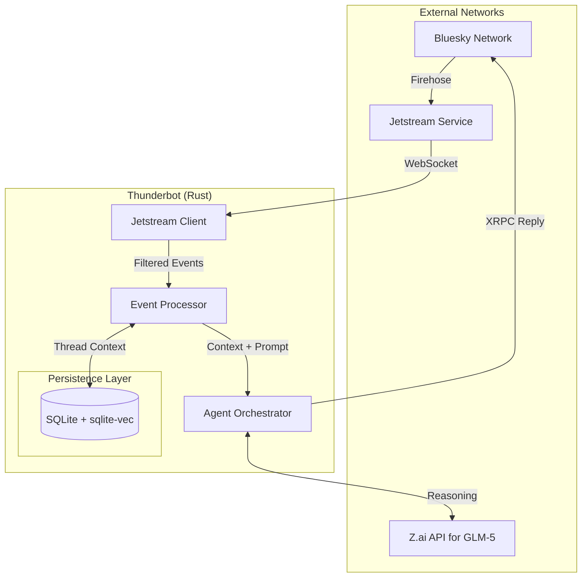

# Thunderbot

Stateful AI agent that lives on Bluesky.

## Quick Start

### Prerequisites

- Rust 1.85+
- A Bluesky account with an App Password
- (Optional) GLM-5 API key for AI responses

### Installation

```bash
# Clone and build
git clone https://github.com/yourusername/thunderbot.git
cd thunderbot
cargo build --release

# Or run directly with cargo
cargo run -p tnbot-cli -- --help
```

## Configuration

Configuration is loaded from (in order of precedence):

1. `--config /path/to/config.toml` flag
2. `tnbot.toml` in the working directory
3. Environment variables (prefixed with `TNBOT_`)
4. `.env` file in the working directory

### Minimal Configuration

Create a `.env` file in your working directory:

```bash
# Required: Your Bluesky credentials
BSKY_HANDLE=yourhandle.bsky.social
BSKY_APP_PASSWORD=your-app-password-here

# Required: Your bot's DID (find it at https://plc.directory/yourhandle.bsky.social)
TNBOT_BOT_DID=did:plc:xxxxx

# Optional: Database location (default: ./data/thunderbot.db)
TNBOT_DATABASE_PATH=./data/thunderbot.db

# Optional: GLM-5 API key for AI responses
GLM_5_API_KEY=your-glm5-api-key
```

Or use a `tnbot.toml` file:

```toml
[bot]
name = "ThunderBot"
did = "did:plc:xxxxx"

[bluesky]
handle = "yourhandle.bsky.social"
app_password = "your-app-password-here"
pds_host = "https://bsky.social"

[database]
path = "./data/thunderbot.db"

[logging]
level = "info"
format = "pretty"  # or "json"
```

### Getting Your DID

```bash
# Resolve your handle to a DID
cargo run -p tnbot-cli -- bsky resolve yourhandle.bsky.social
```

## Usage

### Bluesky Commands

```bash
# Authenticate and test your credentials
tnbot bsky login

# Check current session
tnbot bsky whoami

# Create a new post
tnbot bsky post "Hello from Thunderbot!"

# Reply to a post
tnbot bsky reply "at://did:plc:xxx/app.bsky.feed.post/xxx" "This is my reply"

# Resolve a handle to DID
tnbot bsky resolve alice.bsky.social

# Fetch a post record
tnbot bsky get-post "at://did:plc:xxx/app.bsky.feed.post/xxx"

# All commands support --json for machine-readable output
tnbot --json bsky whoami
```

### Database Commands

```bash
# Initialize the database (run migrations)
tnbot db migrate

# Show database statistics
tnbot db stats

# List recent conversation threads
tnbot db threads

# View a specific thread
tnbot db thread "at://did:plc:xxx/app.bsky.feed.post/rootxxx"

# List cached identity mappings
tnbot db identities
```

### Jetstream Commands

```bash
# Listen to the firehose (ctrl+c to stop)
tnbot jetstream listen

# Listen filtered to mentions of your bot
tnbot jetstream listen --filter-did did:plc:yourbotdid

# Listen for a specific duration
tnbot jetstream listen --duration 60

# Replay from a specific cursor
tnbot jetstream replay --cursor 1234567890
```

### Running the Bot

```bash
# Start the bot daemon
tnbot serve

# Dry-run mode (processes events but doesn't post replies)
tnbot serve --dry-run

# With verbose logging
tnbot -vv serve

# Output logs as JSON
tnbot --json serve
```

## Development

```bash
# Run tests
cargo test

# Check code formatting and linting
cargo fmt --check
cargo clippy -- -D warnings

# Run with custom config
cargo run -p tnbot-cli -- -c /path/to/config.toml serve
```

## Container Deployment

```bash
# Build the image
docker build -t thunderbot .

# Run with environment variables
docker run -e BSKY_HANDLE=yourhandle.bsky.social \
           -e BSKY_APP_PASSWORD=xxx \
           -e TNBOT_BOT_DID=did:plc:xxx \
           --rm thunderbot serve
```

## Project Structure

```sh
crates/
├── cli/          # Command-line interface
├── core/         # Core library (XRPC client, database, processing)
└── web/          # Web dashboard (future)
```

## Architecture

Thunderbot is a stateful AI agent built on:

- **Runtime**: Rust with Tokio async runtime
- **State Store**: SQLite (libSQL) for conversation persistence
- **Ingestion**: Bluesky Jetstream firehose via WebSocket
- **Protocol**: AT Protocol XRPC for posting and identity
- **AI**: GLM-5 via REST API
- **Frontend**: HTMX + Pico CSS dashboard

It uses an event-driven architecture built in Rust that ingests the AT Protocol firehose via Jetstream, filters for mentions, reconstructs thread history from a local database, and uses GLM-5 to generate context-aware responses.


